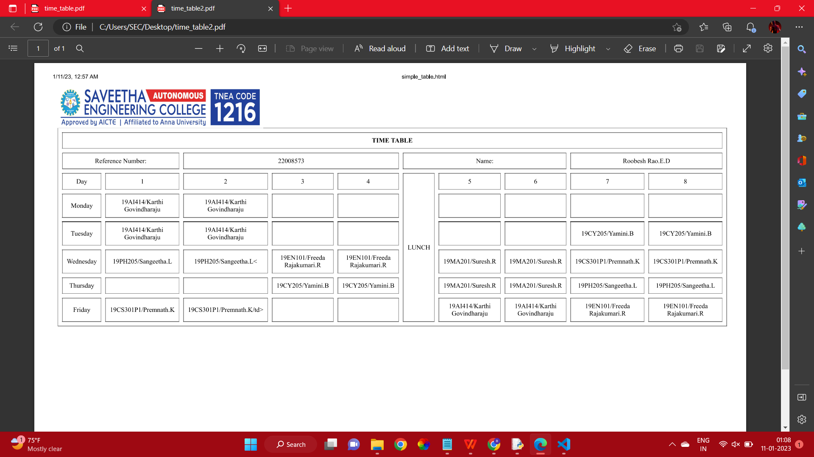

# Experiment_Time_Table

## AIM
To Write a html webpage page to display your timetable.

# ALGORITHM
### STEP 1
create a simple table using table tag
### STEP 2
Add header row using th tag
### STEP 3
Add your timetable
### STEP 4
Execute the program

# CODE
```
</img>
<html>
 <TABLE BORDER="1" width="1200" height="200" bgcolor="cyan" cellspacing="10" cellpadding="10"> 
  <TR> 
	<TH colspan="12" align="center" bgcolor="red">TIME TABLE</TH>
      
      
  </TR>   
  <TR>
     <TD colspan="3" align="center" bgcolor="red">Reference Number:</TH>
     <TD colspan="3" align="center" bgcolor="red">22008573</TH>
     <TD colspan="3" align="center" bgcolor="red">Name:</TH>
     <TD colspan="3" align="center" bgcolor="red">Roobesh Rao.E.D</TH>
  </TR>
  <TR>
     <TD colspan="2"align="center" bgcolor="red">Day</TH>
     <TD  align="center" bgcolor="red">1</TH>
     <TD  align="center" bgcolor="red">2</TH>
     <TD  align="center" bgcolor="red">3</TH>
     <TD  align="center" bgcolor="red">4</TH>
     <TD  rowspan="6" align="center" bgcolor="red">LUNCH</TH>     
     <TD  align="center" bgcolor="red">5</TH>
     <TD  align="center" bgcolor="red">6</TH>
     <TD  align="center" bgcolor="red">7</TH>
     <TD  align="center" bgcolor="red">8</TH>
  </TR>

  <tr>
     <td colspan="2"align="center" bgcolor="red">Monday</td>
     <td align="center" bgcolor="red">19AI414/Karthi Govindharaju</td>
     <td align="center" bgcolor="red">19AI414/Karthi Govindharaju</td>
     <td align="center" bgcolor="red"></td>
     <td align="center" bgcolor="red"></td>
     <td align="center" bgcolor="red"></td>
     <td align="center" bgcolor="red"></td>
     <td align="center" bgcolor="red"></td>
     <td align="center" bgcolor="red"></td>
  </tr>

  <tr>
     <td colspan="2"align="center" bgcolor="red">Tuesday</td>
     <td align="center" bgcolor="red">19AI414/Karthi Govindharaju</td>
     <td align="center" bgcolor="red">19AI414/Karthi Govindharaju</td>
     <td align="center" bgcolor="red"></td>
     <td align="center" bgcolor="red"></td>
     <td align="center" bgcolor="red"></td>
     <td align="center" bgcolor="red"></td>
     <td align="center" bgcolor="red">19CY205/Yamini.B</td>
     <td align="center" bgcolor="red">19CY205/Yamini.B</td>
  </tr>

  <tr>
     <td colspan="2"align="center" bgcolor="red">Wednesday</td>
     <td align="center" bgcolor="red">19PH205/Sangeetha.L</td>
     <td align="center" bgcolor="red">19PH205/Sangeetha.L<</td>
     <td align="center" bgcolor="red">19EN101/Freeda Rajakumari.R</td>
     <td align="center" bgcolor="red">19EN101/Freeda Rajakumari.R</td>
     <td align="center" bgcolor="red">19MA201/Suresh.R</td>
     <td align="center" bgcolor="red">19MA201/Suresh.R</td>
     <td align="center" bgcolor="red">19CS301P1/Premnath.K</td>
     <td align="center" bgcolor="red">19CS301P1/Premnath.K</td>
  </tr>

  <tr>
     <td colspan="2"align="center" bgcolor="red">Thursday</td>
     <td align="center" bgcolor="red"></td>
     <td align="center" bgcolor="red"></td>
     <td align="center" bgcolor="red">19CY205/Yamini.B</td>
     <td align="center" bgcolor="red">19CY205/Yamini.B</td>
     <td align="center" bgcolor="red">19MA201/Suresh.R</td>
     <td align="center" bgcolor="red">19MA201/Suresh.R</td>
     <td align="center" bgcolor="red">19PH205/Sangeetha.L</td>
     <td align="center" bgcolor="red">19PH205/Sangeetha.L</td>
  </tr>

  <tr>
     <td colspan="2"align="center" bgcolor="red">Friday</td>
     <td align="center" bgcolor="red">19CS301P1/Premnath.K</td>
     <td align="center" bgcolor="red">19CS301P1/Premnath.K/td>
     <td align="center" bgcolor="red"></td>
     <td align="center" bgcolor="red"></td>
     <td align="center" bgcolor="red">19AI414/Karthi Govindharaju</td>
     <td align="center" bgcolor="red">19AI414/Karthi Govindharaju</td>
     <td align="center" bgcolor="red">19EN101/Freeda Rajakumari.R</td>
     <td align="center" bgcolor="red">19EN101/Freeda Rajakumari.R</td>
  </tr>

  

 </TABLE>
</html>
```
# OUPUT

